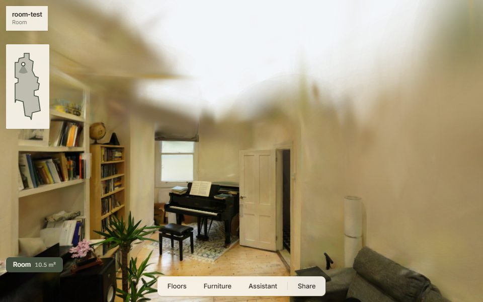

# walkthrough

Walk through a real apartment in the browser. Film a room on an iPhone, scan
it with LiDAR, and get a photoreal 3D Gaussian-splat scene you can walk
around, refloor and furnish, with one AI assistant driving the changes.

Working name until a brand is chosen. Audience: investors and the first
estate agents.



## What it does

- **Walk the flat.** Click the floor to walk, drag to look, wheel to zoom.
  Collision with walls; rooms connect through doors only.
- **Change the floor.** 16 materials (wood, tile, stone, painted, stencilled,
  vintage), or upload a photo of a tile and it is rectified and tiled.
- **Furnish it.** Four themes (Contemporary, Mid-Century, Industrial,
  Period), placed by hand or by a rule-based layout solver.
- **Ask the assistant.** It picks from the catalog only; every id it names is
  checked server-side before it reaches the viewer.
- **Share it.** The whole arrangement is encoded in the link.
- **Compare and reset.** Every change is one press from the real capture.

## How it fits together

```
Stray Scanner (video + ARKit poses + LiDAR) ─┐
                                             ├─► pipeline (WSL2, GPU) ─► scene.spz + manifest ─► viewer
Polycam Floorplan (walls, doors)  ───────────┘   frames → poses → train → align → export
```

| Folder | What |
|---|---|
| `apps/web/` | Viewer and editor: Vite, React, TypeScript, three.js, Spark |
| `services/api/` | FastAPI + SQLite: manifests, catalog, uploads, chat, analytics |
| `pipeline/` | Typer CLI: video + scan → scene |
| `catalog/` | Floors, furniture and themes (JSON) |
| `scripts/` | Seeding, the synthetic demo scene, pipeline setup |
| `docs/` | Brief, spec, capture guide, pipeline, progress |
| `data/` | Git-ignored: projects, captures, downloaded assets |

## Run it

Needs Node 20+, pnpm and [uv](https://docs.astral.sh/uv/).

```bash
pnpm install
uv sync
cp .env.example .env          # set EDITOR_PASSWORD and SESSION_SECRET

pnpm seed:testscene           # synthetic 7-room demo flat
pnpm seed:floors
pnpm seed:assets              # real textures and furniture meshes (~150 MB)

pnpm dev                      # web on :5173, API on :8000
```

Open http://localhost:5173.

## Turn a real room into a scene

Needs Windows with an NVIDIA GPU (built on an RTX 2080 Super, 8 GB) and WSL2.

```bash
wsl --install -d Ubuntu
pnpm run setup:pipeline       # once: CUDA, torch, gsplat, COLMAP inside WSL

pnpm run pipeline run-all "C:\captures\stray\8a3f1c2e" --project flat-01 --roomplan "C:\captures\room.glb"
```

Capture with **Stray Scanner** (free) and scan walls with **Polycam Floorplan**
(free); a plain video file also works, with lower quality. About 40 minutes per
room on the 2080 Super, most of it training. Then open
`http://localhost:5173/p/flat-01` and press Reset to see the raw capture.

How to film: [`docs/CAPTURE.md`](docs/CAPTURE.md). How the stages work, measured
results and known failure modes: [`docs/PIPELINE.md`](docs/PIPELINE.md).

## Test

```bash
pnpm test        # pytest + vitest
pnpm lint        # ruff + eslint + tsc
pnpm test:e2e    # Playwright, with `pnpm dev` running
```

CI runs lint, unit tests and the Playwright smoke suite. No GPU jobs.

## Status

Working: viewer, floors, furniture, layout solver, share links, floor upload,
and the full capture pipeline, run end to end on real photos (held-out PSNR
33.9 dB).

Not yet: a real iPhone capture and RoomPlan scan through the pipeline, the
assistant's measured accuracy (needs an API key), recolouring captured
furniture, privacy masks in the editor, deployment.

Details: [`docs/PROGRESS.md`](docs/PROGRESS.md). Scope: [`docs/BRIEF.md`](docs/BRIEF.md).

## Licences

Code dependencies and assets are CC0, MIT, Apache-2.0 or BSD. Training uses
gsplat (Apache-2.0), never the non-commercial Inria `gaussian-splatting`.
